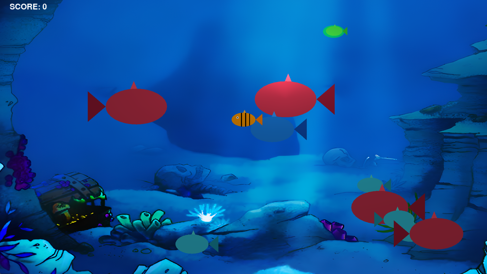
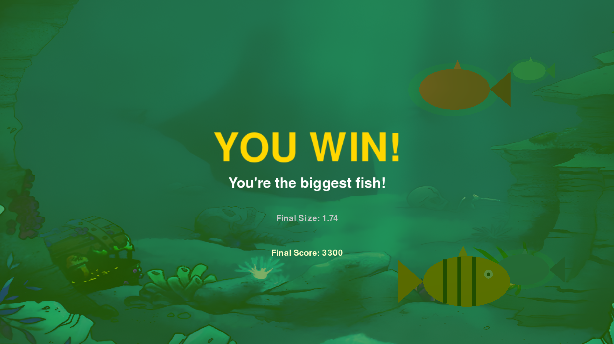
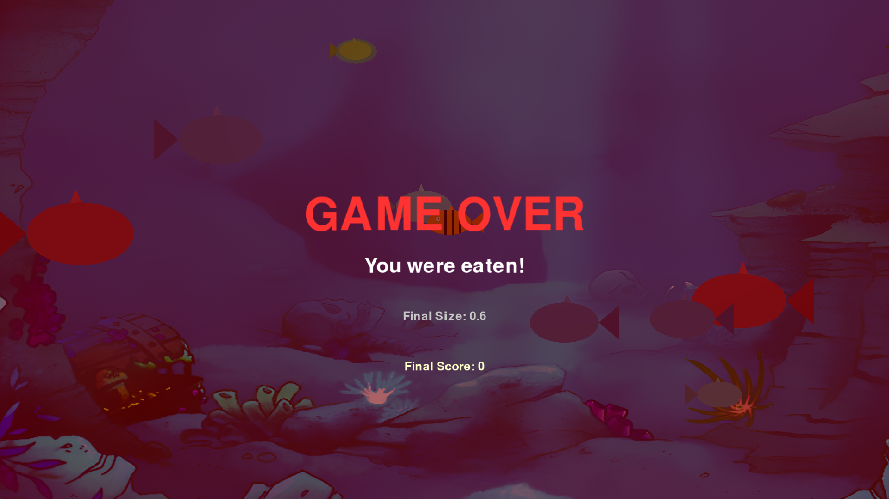

# 🐠 Feeding Frenzy

A 3D underwater arcade game built from scratch in **Python, Pygame, and PyOpenGL** — grow your fish by eating anything smaller than you, avoid anything bigger, and become the biggest fish in the reef.

---

## 🎮 About

Feeding Frenzy is a real-time, OpenGL-rendered take on the classic "eat-to-grow" arcade formula. Every fish on screen — player and enemies alike — is drawn entirely with raw OpenGL primitives (triangle fans, triangles, and quads); there are no sprite assets for the fish themselves. The scene is lit with a dynamic Phong-style light source, the HUD/UI text is rendered by converting Pygame font surfaces into OpenGL textures on the fly, and the whole thing runs on the classic fixed-function OpenGL pipeline via `PyOpenGL`.

You play as a single fish navigating an open underwater arena. Smaller (or equal-sized) enemy fish can be eaten to grow and score points; larger fish end the game on contact. Reach the target size to win.

---

## 🎥 Demo

### 1. Start Screen


### 2. Gameplay


### 3. Win Screen


### 4. Game Over Screen


---

## ✨ Features

* **Procedurally Drawn Fish — No Sprites:** Every fish (player and enemy) is built live from OpenGL primitives — an elliptical triangle-fan body, triangle tail and dorsal fin, and a circular eye for the player — with enemy colors tiered automatically by size.
* **Dynamic Lighting:** A real `GL_LIGHT0` light source with ambient, diffuse, and specular components lights the scene, combined with `GL_COLOR_MATERIAL` so each fish's flat color still responds to the lighting.
* **Size-Based Predator/Prey Collision:** Collision boxes scale with each fish's current size in real time — eat anything your size or smaller to grow and score, get eaten by anything bigger.
* **"Safe to Eat" Indicator:** Enemies you can currently eat are highlighted with a pulsing, alpha-blended green halo rendered behind them, so you always know what's safe to approach.
* **Procedural Enemy Spawner:** Enemies spawn from either screen edge with randomized size, speed, and vertical position, are capped at a maximum count, and auto-despawn once off-screen.
* **GL-Rendered HUD & Text:** All on-screen text (score, titles, subtitles) is rendered by drawing a Pygame font surface to a texture and mapping it onto a screen-space quad every frame — no native 2D overlay.
* **Full Game State Machine:** Start screen → live gameplay → win/lose screen, with a timed delay before the game automatically exits after a win or loss.
* **Audio Layer:** Looping background music plus one-shot eat/win/lose sound effects via `pygame.mixer`.

---

## 🛠️ Tech Stack

* **Language:** Python 3
* **Windowing / Input / Audio:** [Pygame](https://www.pygame.org/) — window creation, keyboard input, font rendering, and sound
* **Rendering:** [PyOpenGL](http://pyopengl.sourceforge.net/) — fixed-function (immediate mode) OpenGL pipeline for all 3D rendering, lighting, and texturing
* **Math:** Python's built-in `math` and `random` modules for fish geometry, spawning, and the pulse animation

---

## 🗂️ Project Structure

```
FeedingFrenzy/
├── FeedingFrenzy.py        # Main game: init, rendering, game loop, physics, collisions
├── audio/
│   ├── background_music.mp3
│   ├── eat.wav
│   ├── win.wav
│   └── lose.wav
├── Demo/
│   ├── Start.png
│   ├── gamePlay.png
│   ├── Win.png
│   ├── GameOver.png
│   └── background.png      # In-game background texture
└── README.md
```

---

## 🕹️ How to Play

| Control | Action |
| :--- | :--- |
| **Any key** | Start the game from the title screen |
| **W / A / S / D** | Move your fish up / left / down / right |

* Eat any fish **equal to or smaller than you** → grow slightly and gain **+100 score**.
* Touching a fish **larger than you** → game over.
* Grow your fish to a scale of **1.7** → you win.
* Enemies you can currently eat pulse with a **green halo** so you can spot safe targets at a glance.

---

## 🚀 Setup & Local Development

1. **Clone the repository:**
```bash
git clone https://github.com/<your-username>/FeedingFrenzy.git
cd FeedingFrenzy
```

2. **Install dependencies:**
```bash
pip install pygame PyOpenGL PyOpenGL_accelerate
```

3. **Run the game** (from the project root, so the relative `audio/` and `Demo/` paths resolve correctly):
```bash
python FeedingFrenzy.py
```

> **Note:** The game launches at a fixed `1920x1080` resolution in fullscreen OpenGL mode. Make sure your display supports this, or adjust the `display` tuple in `main()` before running.

---

## ⚠️ Disclaimer

This is an academic project built for a Computer Graphics course, focused on demonstrating real-time 3D rendering, lighting, and OpenGL primitive-based modeling rather than production game architecture. The renderer uses the legacy OpenGL fixed-function (immediate mode) pipeline for clarity and simplicity rather than a modern shader-based pipeline.
